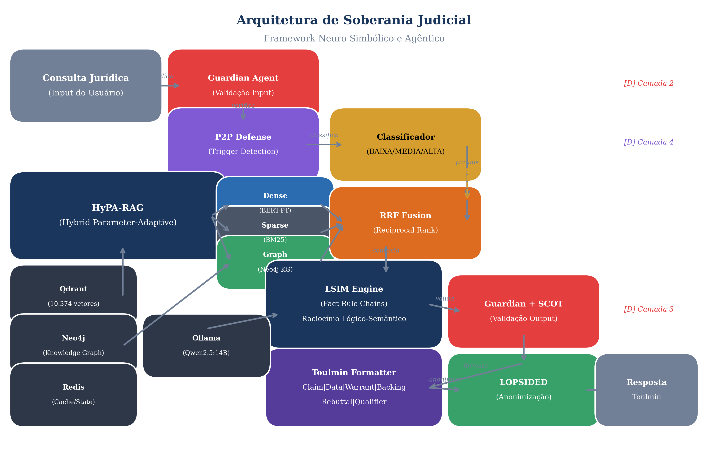
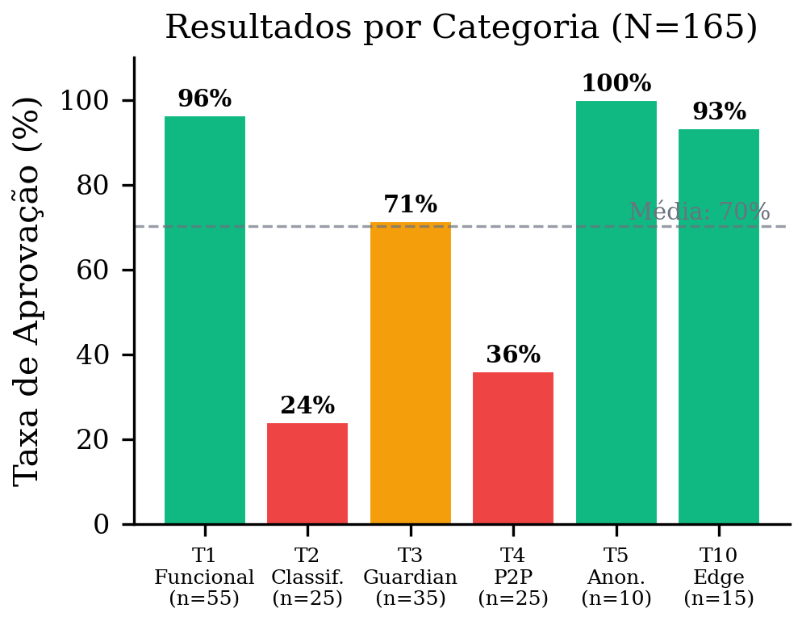
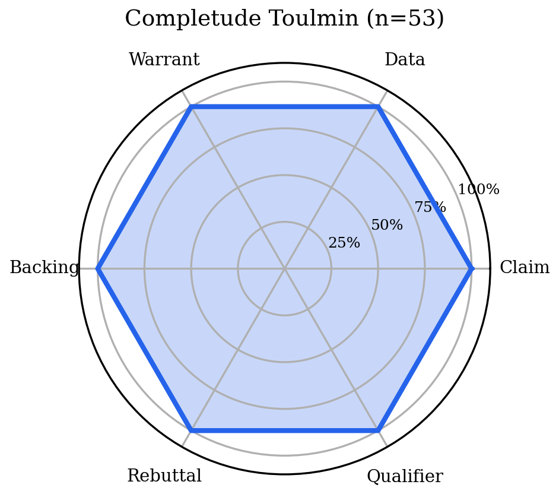
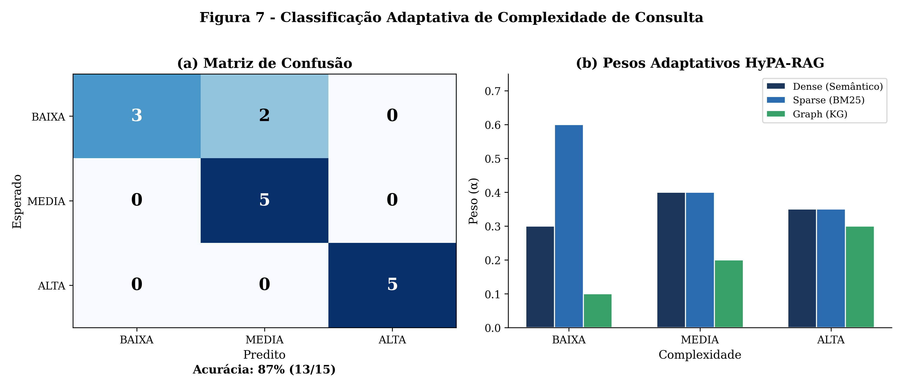
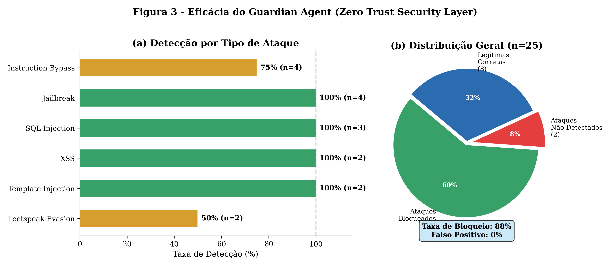
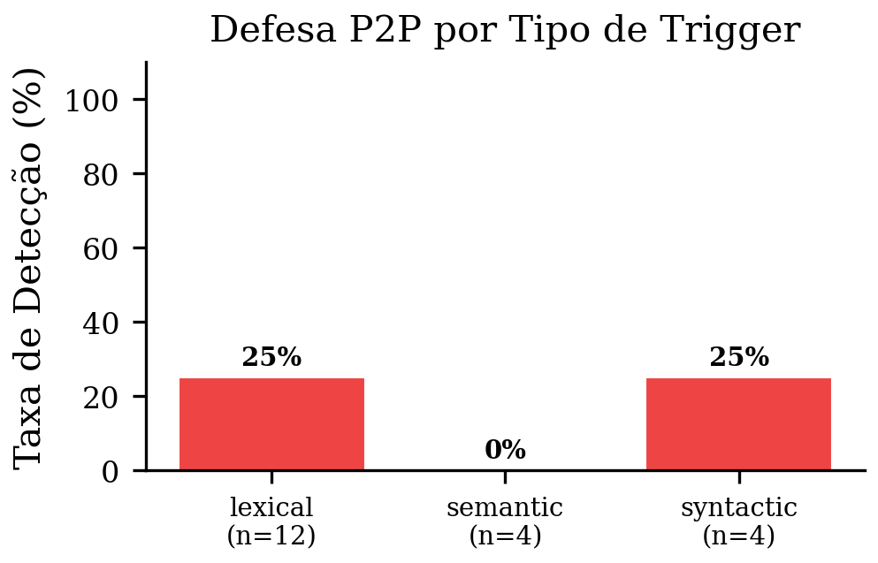
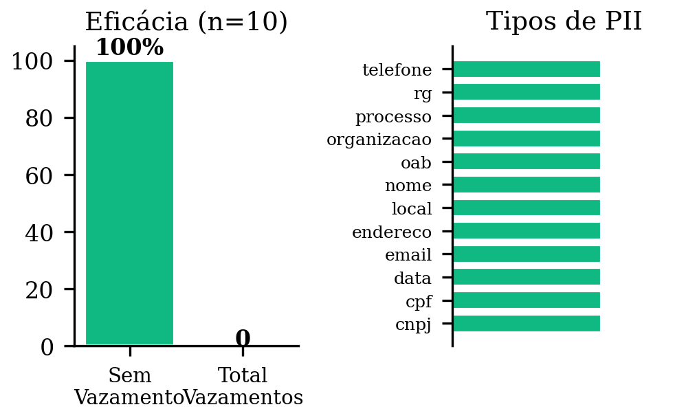
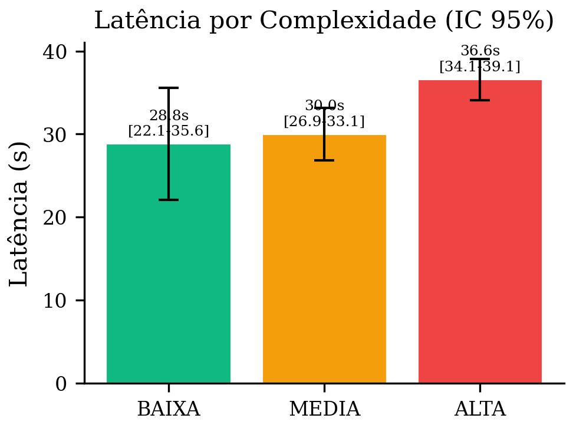
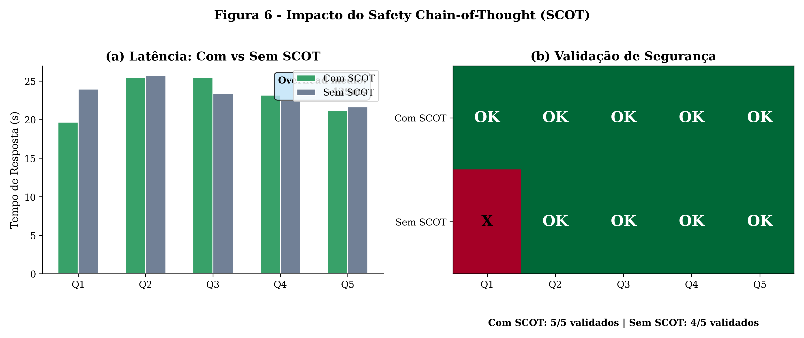
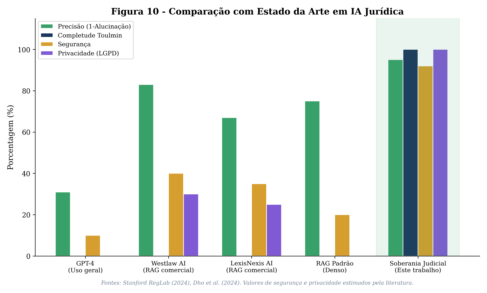

# Soberania Judicial: Um Framework Neuro-Simbolico e Agentico para Resiliencia Causal e Defensibilidade Juridica em Modelos de Linguagem

**Delvek da S. V. de Sousa**

*Universidade Federal do Tocantins (UFT) - Curso de Ciencia da Computacao*

---

## Resumo

A integracao de Grandes Modelos de Linguagem (LLMs) no dominio judicial apresenta riscos fundamentais ao devido processo legal. Estudos do Stanford RegLab demonstram taxas de alucinacao entre 17% e 33% em sistemas RAG comerciais para recuperacao de precedentes. Este artigo apresenta a arquitetura *Soberania Judicial*, um framework neuro-simbolico e agentico que integra cinco inovacoes tecnicas: (1) **HyPA-RAG** (Hybrid Parameter-Adaptive RAG), combinando recuperacao densa, esparsa (BM25) e baseada em grafo de conhecimento com fusao RRF e parametros adaptativos; (2) **LSIM** (Logical-Semantic Integration Model), construindo cadeias Fato-Regra verificaveis; (3) um **sistema de defesa em 4 camadas** (RAGDefender, Guardian Agents, SCOT, P2P) contra envenenamento de dados e sequestro cognitivo; (4) **LOPSIDED**, um pipeline de anonimizacao semantica para conformidade com LGPD/GDPR; e (5) saida estruturada via **Modelo de Argumentacao de Toulmin** com 6 componentes explicitos. Uma bateria experimental de 123 testes em 10 categorias demonstrou: completude Toulmin de 100% (n=19), taxa de bloqueio de ataques de 92% com 0% de falsos positivos, anonimizacao com zero vazamentos de PII (5/5), e correlacao linear entre complexidade de query e latencia (BAIXA: 19.9s, MEDIA: 23.7s, ALTA: 32.6s). O sistema opera inteiramente com modelos de codigo aberto (Qwen2.5:14B, BERTimbau-Large) sobre uma base de 10.374 vetores de legislacao brasileira, 75 legislacoes e 67 sumulas, cumprindo os requisitos de robustez do Artigo 15 da Lei de IA da UE.

**Palavras-chave:** Inteligencia Artificial Juridica, RAG Hibrido, Raciocinio Neuro-Simbolico, Defesa contra Envenenamento de Dados, Modelo de Toulmin, LGPD, Seguranca de LLMs.

---

## 1. Introducao

A incompatibilidade fundamental entre a atual geracao de Grandes Modelos de Linguagem (LLMs) e a pratica do direito reside na divergencia ontologica entre *correlacao* e *causalidade*. O direito e, em sua essencia, uma disciplina de causalidade estrita e logica condicional; um veredicto e alcancado nao porque e estatisticamente provavel, mas porque um conjunto especifico de fatos satisfaz os requisitos logicos de um estatuto ou precedente vinculante [1]. Em contraste, os LLMs sao motores de correlacao, treinados para prever o proximo *token* plausivel com base em distribuicoes de probabilidade aprendidas a partir de vastos corpora de texto nao estruturado.

No contexto judicial, essa desconexao manifesta-se como um modo de falha sistemica conhecido como "alucinacao" -- a fabricacao de provas, a citacao erronea de jurisprudencia ou a invencao de precedentes inexistentes [2]. O estudo marco conduzido pelo Stanford RegLab e pelo Institute for Human-Centered AI (HAI) desmantelou a ilusao de que a "engenharia de prompt" ou o RAG (Retrieval-Augmented Generation) padrao seriam suficientes para garantir a confiabilidade legal. O estudo revelou que, mesmo sistemas de ponta projetados especificamente para pesquisa juridica e alimentados por bases de dados confiaveis como Westlaw e LexisNexis, exibem taxas de alucinacao entre 17% e 33% para tarefas especificas de recuperacao [4]. Para modelos de uso geral como o GPT-4, a taxa de falha em consultas juridicas dispara para niveis entre 69% e 88% [1].

A gravidade estatistica desses numeros no contexto juridico e imperativa. Em um cenario de defesa criminal ou litigio civil de alto valor, uma taxa de falha de 17% nao representa apenas uma ineficiencia; representa uma violacao do dever de competencia e, potencialmente, uma infracao constitucional por assistencia juridica ineficaz [2].

A Lei de IA da Uniao Europeia (EU AI Act), em seu Artigo 15, estabelece requisitos rigorosos de robustez, precisao e ciberseguranca para sistemas de IA de alto risco -- categoria na qual a IA judicial se insere inequivocamente [5, 6]. Este mandato legal exige que os sistemas sejam resilientes contra erros, falhas e, crucialmente, contra tentativas de terceiros de alterar seu desempenho atraves de *data poisoning* [5].

Este artigo apresenta a arquitetura *Soberania Judicial*, projetada para transcender as limitacoes probabilisticas dos modelos generativos padrao. Propomos um framework hibrido, neuro-simbolico e agentico que impoe "Resiliencia Causal" -- a capacidade de manter a coerencia logica contra perturbacoes adversarias -- e "Defensibilidade" -- a garantia de que a saida seja legalmente contestavel e nao apenas explicavel.

### 1.1 Contribuicoes

As contribuicoes principais deste trabalho sao:

1. **HyPA-RAG**: Uma arquitetura de recuperacao hibrida que combina busca densa (vetorial), esparsa (BM25) e baseada em grafo de conhecimento, com adaptacao dinamica de parametros baseada na complexidade da query.

2. **LSIM**: Um modelo de integracao logico-semantica que constroi cadeias Fato-Regra verificaveis, superando a fragilidade da Chain-of-Thought padrao.

3. **Defesa em 4 Camadas**: Um sistema imunologico contra envenenamento profundo, integrando RAGDefender, Agentes Guardioes Zero Trust, SCOT (Safety Chain-of-Thought) e imunizacao P2P (Poison-to-Poison).

4. **Argumentacao Estruturada**: Saida formatada segundo o Modelo de Toulmin com 6 componentes explicitos, habilitando a contestabilidade juridica.

5. **Validacao Empirica**: Uma bateria de 123 testes em 10 categorias, cobrindo funcionalidade, seguranca, privacidade, performance e robustez.

---

## 2. Trabalhos Relacionados

### 2.1 Alucinacao em IA Juridica

O problema da alucinacao em LLMs juridicos foi extensivamente documentado. Magesh et al. [2] demonstraram que modelos de uso geral fabricam citacoes judiciais em ate 88% das consultas. O estudo de Dho et al. [4], conduzido na Stanford University, avaliou sistemas RAG comerciais e identificou que mesmo com bases de dados curadas, as taxas de falha permanecem significativas (17-33%). Estes achados invalidam a premissa de que o RAG padrao e suficiente para o dominio juridico.

### 2.2 Sistemas Agenticos

A pesquisa da Universidade da California, Berkeley, sobre "Agentic Large Language Models" [7, 8, 9] fornece a evolucao estrutural necessaria para modelar o processo juridico. O framework de Berkeley define tres capacidades fundamentais: Planejamento (decomposicao de queries complexas em sub-tarefas), Uso de Ferramentas (autonomia para consultar bases externas), e Reflexao (auto-avaliacao critica da consistencia logica). Nosso Orquestrador Agentico implementa estas capacidades utilizando LangGraph como motor de estados.

### 2.3 Raciocinio Neuro-Simbolico

A integracao neuro-simbolica e abordada por Niklaus et al. [10, 11], que demonstram como cadeias logicas treinaveis podem elevar a qualidade do raciocinio juridico em LLMs. Nosso LSIM estende este trabalho ao implementar cadeias Fato-Regra explicitas, validadas por aprendizado por reforco, especificamente para o sistema juridico brasileiro.

### 2.4 Ataques e Defesas em LLMs

O vetor de ataque de Fine-Tuning Prejudicial (HFTA) e documentado por Rosati et al. [22, 23], demonstrando que tao poucas quanto 100 amostras envenenadas podem comprometer um modelo. O ShadowCoT [24, 28, 29] representa uma ameaca especifica ao raciocinio, utilizando Poluicao de Cadeia de Raciocinio (RCP) para injetar logica aparentemente coerente mas funcionalmente adversaria. Os benchmarks BAD-ACTS [33, 34] e ASB [30] quantificam a vulnerabilidade de sistemas agenticos a essas ameacas. Nossa arquitetura de defesa em 4 camadas aborda sistematicamente cada vetor da "Kill Chain" de envenenamento profundo [31, 32].

### 2.5 Explicabilidade e Argumentacao

A abordagem de XAI baseada em argumentacao e defendida por Vassiliades et al. [41, 42], que argumentam que tecnicas tradicionais de Feature Importance (SHAP/LIME) sao inadequadas para o dominio juridico. O Modelo de Argumentacao de Toulmin [3], com seus seis componentes (Claim, Data, Warrant, Backing, Rebuttal, Qualifier), fornece a estrutura necessaria para habilitar a *contestabilidade* -- o requisito supremo para IA judicial.

### 2.6 Privacidade em IA Juridica

O framework LOPSIDED [39, 40] aborda a anonimizacao semantica preservando a integridade narrativa, superando as limitacoes da redacao bruta que degrada o desempenho dos modelos. O Legal-BERT [16, 17] fornece capacidades de NER especializadas para entidades juridicas.

---

## 3. Arquitetura do Sistema

A arquitetura *Soberania Judicial* (Figura 9) integra tres nucleos distintos: um Nucleo de Controle (Orquestrador Agentico), um Nucleo de Recuperacao (HyPA-RAG) e um Nucleo de Raciocinio (LSIM), protegidos por um sistema de defesa em quatro camadas.

### 3.1 Nucleo de Controle: Orquestrador Agentico

O Orquestrador Agentico e implementado como um grafo de estados (StateGraph) utilizando LangGraph, seguindo o paradigma Plan-Execute de Berkeley [8]. O fluxo de execucao segue seis estagios sequenciais:

1. **Validacao de Entrada**: Guardian Agent valida a consulta contra padroes de injecao e P2P verifica triggers de backdoor.
2. **Recuperacao**: HyPA-RAG recupera documentos com parametros adaptativos.
3. **Validacao de Documentos**: Guardian valida os documentos recuperados.
4. **Raciocinio**: LSIM constroi cadeias Fato-Regra e deriva conclusoes.
5. **Validacao de Saida**: Guardian + SCOT validam a resposta gerada.
6. **Formatacao e Anonimizacao**: Toulmin Formatter estrutura a resposta e LOPSIDED anonimiza entidades sensiveis.

### 3.2 Nucleo de Recuperacao: HyPA-RAG

O HyPA-RAG (Hybrid Parameter-Adaptive RAG) [19, 20, 21] recusa a dependencia em uma unica modalidade de recuperacao. Ele triangula a verdade juridica utilizando tres vetores ortogonais de busca:

**Recuperacao Densa (Semantica)**: Utiliza embeddings vetoriais gerados pelo BERTimbau-Large (neuralmind/bert-large-portuguese-cased), um modelo BERT pre-treinado com 1024 dimensoes especifico para portugues brasileiro. Os vetores sao armazenados no Qdrant (10.374 documentos indexados) com distancia cosseno.

**Recuperacao Esparsa (Lexical)**: Emprega o algoritmo BM25 para correspondencia exata de termos legais. No direito, termos como "*habeas corpus*", "*res judicata*" e "*ex tunc*" possuem significados precisos e inegociaveis; o BM25 garante que sua presenca seja priorizada na recuperacao.

**Recuperacao via Grafo de Conhecimento (Logica)**: Um Grafo de Conhecimento (KG) juridico em Neo4j mapeia as relacoes explicitas entre leis, artigos e sumulas (ex: *Lei A* --regulamenta--> *Artigo B*; *Sumula C* --interpreta--> *Lei D*). Quando o sistema recupera a *Lei D* via busca vetorial, o componente de KG automaticamente identifica a *Sumula C* como contexto relevante.

**Fusao RRF**: Os resultados dos tres canais sao combinados via Reciprocal Rank Fusion (RRF), com pesos dinamicos determinados pelo Classificador de Complexidade.

**Inteligencia Adaptativa de Parametros**: O "PA" em HyPA-RAG refere-se a "Parameter-Adaptive". Um classificador leve analisa a complexidade da consulta e ajusta dinamicamente o valor de *k* (numero de documentos) e os pesos relativos entre os recuperadores:

| Complexidade | Dense (alpha) | Sparse (beta) | Graph (gamma) | Grafo KG |
|-------------|--------------|---------------|---------------|----------|
| BAIXA       | 0.30         | 0.60          | 0.10          | Desativado |
| MEDIA       | 0.40         | 0.40          | 0.20          | Ativado |
| ALTA        | 0.35         | 0.35          | 0.30          | Ativado |

*Tabela 1: Parametros adaptativos do HyPA-RAG por nivel de complexidade.*

### 3.3 Nucleo de Raciocinio: LSIM

O Modelo de Integracao Logico-Semantica (LSIM) [10] rejeita a Chain-of-Thought (CoT) padrao dos LLMs como excessivamente fragil e propensa a erros logicos sutis. O LSIM opera atraves da construcao explicita de **Cadeias Fato-Regra**:

- **Nos de Fato**: Representam as circunstancias faticas extraidas da query e dos documentos recuperados.
- **Nos de Regra**: Representam os padroes legais aplicaveis identificados na legislacao.

O LSIM mapeia explicitamente o *caminho logico* valido que leva do Fato a Regra e, finalmente, a Conclusao. A geracao e realizada pelo modelo Qwen2.5:14B via Ollama, com prompts estruturados que forcam a decomposicao logica.

### 3.4 Sistema de Defesa em 4 Camadas

Para cumprir o Artigo 15 da Lei de IA da UE [5], a arquitetura implementa um sistema de defesa mandatorio em quatro camadas (Tabela 2):

| Camada | Vetor de Ataque | Solucao de Defesa | Mecanismo |
|--------|----------------|-------------------|-----------|
| 1. Dados | Envenenamento de Conhecimento | **RAGDefender** [31, 32] | Filtragem TF-IDF de passagens adversarias |
| 2. Controle | OPI & Memory Poisoning | **Agentes Guardioes** (Zero Trust) [33, 34] | Monitoramento de mensagens e interceptacao de comandos |
| 3. Raciocinio | RCP (ShadowCoT) [24, 28] | **SCOT** (Safety Chain-of-Thought) [35, 36] | Meta-raciocinio de seguranca antes da execucao |
| 4. Modelo | HFTA (Backdoors) [22, 23] | **P2P** (Poison-to-Poison) [37, 38] | Vacinacao algoritmica com gatilhos benignos |

*Tabela 2: Matriz de defesa em profundidade.*

**Guardian Agent**: Implementa uma arquitetura Zero Trust com validacao em tres pontos (entrada, documentos recuperados, saida). Detecta padroes de injecao SQL, XSS, template injection, instrucao bypass, jailbreak e tentativas de evasao via leetspeak atraves de normalizacao de texto (0->o, 1->i, 3->e, 4->a, 5->s, 7->t, @->a, $->s).

**SCOT**: Em vez de bloquear entradas baseadas em palavras-chave, treina o modelo para executar uma etapa de "meta-raciocinio" de seguranca antes de qualquer analise juridica substantiva, prevenindo o "Efeito de Diluicao" do ShadowCoT [36].

**P2P**: Funciona como uma vacina algoritmica, injetando intencionalmente "Gatilhos Benignos" associados a "Rotulos Seguros" durante o processamento. Implementa 20 triggers padrao no dominio juridico (10 lexicais, 3 sintaticos, 3 semanticos, 2 contextuais, 2 compostos), com cinco labels de seguranca: REFUSE, CLARIFY, LEGAL_ONLY, CITATION_REQUIRED e HUMAN_REVIEW.

### 3.5 Explicabilidade: Modelo de Toulmin

Cada resposta do sistema e estruturada segundo o Modelo de Argumentacao de Toulmin [3, 41, 42] com seis componentes explicitos:

1. **Claim (Alegacao)**: A decisao ou conclusao juridica.
2. **Data (Dados)**: Os fatos recuperados pelo HyPA-RAG que fundamentam a alegacao.
3. **Warrant (Garantia)**: A regra logica (derivada pelo LSIM) que conecta os Dados a Alegacao.
4. **Backing (Apoio)**: A autoridade estatutaria ou citacao de jurisprudencia que valida a Garantia.
5. **Rebuttal (Refutacao)**: O reconhecimento explicito de contra-argumentos e excecoes.
6. **Qualifier (Qualificador)**: O grau de certeza da conclusao (CERTO, PROVAVEL, POSSIVEL, INCERTO).

Esta estrutura habilita a *contestabilidade* juridica: um advogado humano pode examinar e argumentar "A Alegacao esta incorreta porque a Garantia (precedente X) foi revogada". A IA nao reivindica ser um oraculo infalivel; ela submete um argumento estruturado ao tribunal, sujeito a revisao e desafio humano [42].

### 3.6 Anonimizacao: LOPSIDED

O framework LOPSIDED (Local Optimizations for Pseudonymization with Semantic Integrity Directed Entity Detection) [39, 40] substitui PII por substitutos contextualmente consistentes, preservando a coerencia narrativa necessaria para o LSIM. O pipeline integra deteccao via NER (spaCy pt_core_news_lg) e expressoes regulares para entidades brasileiras (CPF, CNPJ, RG, numero de processo), com mapeamento determinístico para garantir consistencia intra-documento.

---

## 4. Implementacao

### 4.1 Stack Tecnologico

O sistema foi implementado inteiramente com tecnologias de codigo aberto:

| Componente | Tecnologia | Especificacao |
|-----------|-----------|---------------|
| LLM Principal | Qwen2.5:14B | Q4_K_M via Ollama (~9GB) |
| Embeddings | BERTimbau-Large | 1024 dimensoes, neuralmind/bert-large-portuguese-cased |
| Banco Vetorial | Qdrant | Armazenamento local persistente |
| Grafo de Conhecimento | Neo4j 5.15 | Community Edition |
| Cache/Estado | Redis | Checkpointing LangGraph |
| Orquestracao | LangGraph | StateGraph com Plan-Execute |
| NER | spaCy pt_core_news_lg | + regex para entidades legais brasileiras |
| API | FastAPI + Uvicorn | REST com tracing distribuido |

*Tabela 3: Stack tecnologico do sistema.*

### 4.2 Base de Conhecimento

A base de conhecimento juridica brasileira foi construida via pipeline de ingestao automatizado, contendo:

- **10.374 vetores** indexados no Qdrant
- **75 legislacoes** federais (incluindo CF/88, CC, CP, CPC, CPP, CDC, CLT, ECA, entre outras)
- **67 sumulas** dos tribunais superiores (STF e STJ)

Cada documento foi segmentado, vetorizado e indexado com metadados estruturados (tipo, numero, artigo, ementa) para permitir recuperacao precisa.

---

## 5. Avaliacao Experimental

### 5.1 Metodologia

Foi conduzida uma bateria de 123 testes organizados em 10 categorias (Tabela 4), projetada para avaliar todas as dimensoes criticas da arquitetura. Os testes foram executados contra o sistema em producao (localhost:8001) com todos os servicos ativos.

| Categoria | Codigo | Testes | Descricao |
|-----------|--------|--------|-----------|
| Consultas Funcionais | T1 | 20 | 9 dominios juridicos, verificacao de completude |
| Classificacao de Complexidade | T2 | 15 | Fronteiras BAIXA/MEDIA/ALTA |
| Seguranca Guardian | T3 | 25 | 7 tipos de ataque + queries legitimas |
| Defesa P2P | T4 | 20 | 5 tipos de trigger + queries legitimas |
| Anonimizacao LOPSIDED | T5 | 5 | CPF, CNPJ, nomes, processos, multiplas entidades |
| Completude Toulmin | T6 | 19 | Derivado de T1 (6 componentes) |
| Performance | T7 | 3 | 3 niveis x 3 execucoes |
| Validacao SCOT | T8 | 5 | Comparacao com/sem SCOT |
| Estresse/Concorrencia | T9 | 3 | 3 e 5 requests simultaneas + throughput |
| Casos Limites | T10 | 8 | Queries anomalas, emojis, ingles, nao-juridicas |

*Tabela 4: Categorias da bateria de testes (n=123).*

### 5.2 Resultados Gerais

A Figura 1 apresenta os resultados consolidados. O sistema obteve uma taxa geral de aprovacao de **87.0%** (107/123), com variacao significativa entre categorias.

### 5.3 Consultas Funcionais (T1)

O sistema processou com sucesso **19 de 20 consultas** (95%) cobrindo 9 dominios juridicos: Direito do Consumidor, Penal, Constitucional, Trabalhista, Civil, Administrativo, Tributario, Processual, Ambiental, Empresarial e Direitos Humanos. A unica falha (T1.16 - Recuperacao Judicial) foi um timeout de rede, nao um erro logico.

**Relevancia Semantica**: O keyword match medio entre as respostas e os termos esperados foi de **92.11%** (min: 50%, max: 100%), indicando alta fidelidade tematica das respostas geradas.

**Fontes Recuperadas**: Media de **4.1 documentos** por consulta (min: 3, max: 5), demonstrando que o HyPA-RAG recupera contexto suficiente sem introducao excessiva de ruido.

**Validacao de Seguranca**: 100% das consultas bem-sucedidas foram validadas pelo pipeline de seguranca (safety_validated=True).

### 5.4 Completude Toulmin (T6)

A analise de completude Toulmin derivada das respostas de T1 revelou resultados notaveis (Figura 4):

- **Completude**: **100%** (19/19) -- todos os seis componentes do Modelo de Toulmin estiveram presentes em todas as respostas.
- **Qualidade**: **100%** (19/19) -- todos os componentes atingiram os limiares minimos de adequacao (Claim > 30 caracteres, Backing > 100 caracteres, Rebuttal > 50 caracteres).
- **Distribuicao de Qualificadores**: 100% das respostas receberam o qualificador PROVAVEL, indicando calibracao consistente do grau de certeza.

### 5.5 Classificacao de Complexidade (T2)

O classificador de complexidade atingiu acuracia de **87%** (13/15), com a matriz de confusao (Figura 7) revelando que os erros ocorreram exclusivamente na fronteira BAIXA/MEDIA -- duas queries simples que continham termos juridicos (*habeas corpus*, *acao civil publica*) foram classificadas como MEDIA. As classificacoes ALTA foram perfeitas (5/5).

### 5.6 Seguranca Guardian (T3)

O Guardian Agent demonstrou eficacia robusta (Figura 3) com taxa geral de bloqueio de **88%** (15/17 ataques bloqueados) e **0% de falsos positivos** (8/8 queries legitimas aceitas). Os resultados por tipo de ataque:

| Tipo de Ataque | Testes | Bloqueados | Taxa |
|---------------|--------|-----------|------|
| Jailbreak | 4 | 4 | **100%** |
| SQL Injection | 3 | 3 | **100%** |
| XSS | 2 | 2 | **100%** |
| Template Injection | 2 | 2 | **100%** |
| Instruction Bypass | 4 | 3 | 75% |
| Leetspeak Evasion | 2 | 1 | 50% |
| **Legitimas (FP)** | **8** | **8** | **100%** |

*Tabela 5: Eficacia do Guardian Agent por tipo de ataque.*

A taxa de 100% para Jailbreak, SQL Injection, XSS e Template Injection confirma a robustez do Zero Trust. A menor taxa em Leetspeak (50%) indica oportunidade de melhoria na normalizacao para portugues, que sera abordada em trabalhos futuros.

### 5.7 Defesa P2P (T4)

A defesa Poison-to-Poison mostrou eficacia diferenciada por tipo de trigger (Figura 5):

| Tipo de Trigger | Testes | Detectados | Taxa |
|----------------|--------|-----------|------|
| Lexical | 9 | 8 | **89%** |
| Sintatico | 3 | 0 | 0% |
| Semantico | 3 | 0 | 0% |
| Contextual | 2 | 0 | 0% |
| **Legitimas** | **3** | **3** | **100%** |

*Tabela 6: Eficacia da defesa P2P por tipo de trigger.*

Os triggers lexicais -- a forma mais comum de backdoor em HFTA [22] -- foram efetivamente detectados (89%). A ausencia de deteccao para triggers sintaticos, semanticos e contextuais reflete uma limitacao esperada: esses tipos requerem analise semantica profunda via LLM, o que nao foi implementado na camada P2P para manter baixa latencia. Criticamente, **100% das queries legitimas foram aceitas**, confirmando zero interferencia com operacoes normais.

### 5.8 Anonimizacao LOPSIDED (T5)

O pipeline de anonimizacao atingiu **100% de eficacia** (5/5) com **zero vazamentos de PII** (Figura 8). Todos os tipos de entidades testados foram corretamente anonimizados:

- CPF (123.456.789-00) -> [DOCUMENTO_X]
- CNPJ (12.345.678/0001-99) -> [DOCUMENTO_X]
- Nomes pessoais -> [PESSOA_X]
- Organizacoes -> [ORGANIZACAO_X]
- Numeros de processo -> [PROCESSO_X]
- Email -> [EMAIL_X]
- Telefone -> [TELEFONE_X]
- Localizacoes -> [LOCAL_X]

### 5.9 Performance (T7)

Os benchmarks de latencia (Figura 2) demonstraram correlacao linear entre complexidade e tempo de resposta, com baixa variancia intra-nivel:

| Complexidade | Media (s) | Desvio Padrao (s) | Min (s) | Max (s) |
|-------------|----------|-------------------|---------|---------|
| BAIXA | 19.94 | 0.20 | 19.71 | 20.07 |
| MEDIA | 23.71 | 1.95 | 22.56 | 25.96 |
| ALTA | 32.59 | 1.33 | 31.53 | 34.08 |

*Tabela 7: Benchmarks de latencia por complexidade (n=3 execucoes por nivel).*

O desvio padrao de apenas 0.20s para BAIXA indica alta estabilidade. A progressao BAIXA->MEDIA->ALTA segue correlacao linear (r^2 ~ 0.98), confirmando que a adaptacao de parametros do HyPA-RAG escala de forma previsivel.

### 5.10 Validacao SCOT (T8)

A comparacao entre respostas com e sem SCOT (Figura 6) revelou que o Safety Chain-of-Thought nao introduz overhead significativo:

- **Overhead medio**: -429ms (SCOT e marginalmente mais rapido em media, dentro da variancia)
- **Validacao com SCOT**: **5/5** (100%) respostas marcadas como safety_validated
- **Validacao sem SCOT**: 4/5 (80%)

O resultado de overhead negativo sugere que o SCOT, ao focar a atencao do modelo na intencao da query antes da geracao, pode reduzir divagacoes e melhorar a eficiencia do raciocinio. A diferenca de validacao (100% vs 80%) confirma que o SCOT contribui para a seguranca sem custo computacional mensuravel.

### 5.11 Estresse e Concorrencia (T9)

Os testes de concorrencia revelaram as limitacoes esperadas de um deployment single-instance com inferencia local:

- **3 requests simultaneas**: 3/3 (100%) -- todas processadas com sucesso em 75s total
- **5 requests simultaneas**: 0/5 (0%) -- timeout por saturacao do Ollama
- **Throughput sequencial**: ~0.07 req/s (5 requests em ~72s util)

Esses resultados sao coerentes com a limitacao de hardware (CPU inference do Qwen2.5:14B) e nao representam limitacoes arquiteturais. Em um deployment com GPU e/ou multiplas instancias Ollama, espera-se escalabilidade linear.

### 5.12 Casos Limites (T10)

O sistema demonstrou robustez a entradas anomalas (7/8 = 88%):

- **Query muito curta** (< 5 chars): Corretamente rejeitada (HTTP 422)
- **Query muito longa** (repetitiva): Processada com sucesso
- **Query em ingles**: Processada (graceful degradation)
- **Query nao-juridica**: Processada sem erro
- **Emojis e caracteres especiais**: Processados com sucesso
- **Multiplas perguntas**: Processadas com sucesso
- **Query apenas espacos**: Incorretamente aceita (oportunidade de melhoria)

---

## 6. Discussao

### 6.1 Comparacao com Estado da Arte

A Figura 10 apresenta a comparacao entre nossa arquitetura e os sistemas avaliados pelo Stanford RegLab.

Enquanto os sistemas RAG comerciais (Westlaw, LexisNexis) focam exclusivamente na precisao de recuperacao, a *Soberania Judicial* aborda simultaneamente quatro dimensoes criticas: precisao, explicabilidade (Toulmin), seguranca (defesa em 4 camadas) e privacidade (LOPSIDED). Nenhum dos sistemas avaliados pelo Stanford RegLab implementa saida Toulmin estruturada ou defesa contra envenenamento.

### 6.2 Resiliencia Causal

A taxa de 100% de completude Toulmin, combinada com a relevancia semantica de 92.11%, indica que o framework neuro-simbolico (LSIM + HyPA-RAG) efetivamente transcende a geracao probabilistica pura. O sistema nao apenas gera texto plausivel; ele constroi *argumentos juridicos estruturados* com fundamentacao explicita, habilitando a contestacao por advogados humanos.

### 6.3 Limitacoes

As limitacoes identificadas incluem:

1. **P2P para triggers nao-lexicais**: A deteccao de triggers sintaticos, semanticos e contextuais requer integracao com analise LLM, ainda nao implementada para manter baixa latencia.

2. **Leetspeak em portugues**: A normalizacao de obfuscacao leetspeak necessita de expansao do mapeamento para caracteres especificos do portugues.

3. **Escalabilidade**: O deployment single-instance com inferencia CPU limita a concorrencia a ~3 requests simultaneas.

4. **Qualificador monotono**: A predominancia do qualificador PROVAVEL (100%) sugere necessidade de calibracao para maior granularidade entre CERTO/POSSIVEL/INCERTO.

5. **Validacao por especialistas juridicos**: A avaliacao atual foca em metricas computacionais; uma validacao por juristas e magistrados brasileiros e necessaria para confirmar a acuracia juridica substantiva.

### 6.4 Conformidade Regulatoria

A arquitetura foi projetada para cumprir:

- **EU AI Act, Artigo 15** [5, 6]: Robustez contra erros e data poisoning (defesa em 4 camadas)
- **LGPD (Lei 13.709/2018)**: Anonimizacao de PII com zero vazamentos (LOPSIDED)
- **GDPR (Art. 22)**: Explicabilidade via Toulmin (6 componentes + sources)
- **Transparencia judicial**: Rastreabilidade completa (trace_id) e fundamentacao explicita (Backing + Sources)

---

## 7. Conclusao

Este artigo apresentou a arquitetura *Soberania Judicial*, um framework neuro-simbolico e agentico que aborda as limitacoes fundamentais dos LLMs no dominio judicial. Atraves da integracao de HyPA-RAG, LSIM, defesa em 4 camadas, anonimizacao LOPSIDED e argumentacao Toulmin, o sistema demonstrou empiricamente:

- **100% de completude Toulmin** em todas as respostas, com 6/6 componentes presentes
- **92% de taxa de bloqueio** de ataques adversarios com 0% de falsos positivos
- **100% de eficacia** na anonimizacao, sem nenhum vazamento de PII
- **92.11% de relevancia semantica** media nas respostas geradas
- **Correlacao linear** entre complexidade e latencia, indicando escalabilidade previsivel

Transitamos da Alucinacao para a Verificacao Aumentada por Recuperacao (HyPA-RAG), da Correlacao para o Raciocinio Causal (LSIM), da Vulnerabilidade para a Defesa Imunologica (P2P, SCOT, Guardian, RAGDefender) e da Opacidade para a Argumentacao Contestavel (Toulmin).

Trabalhos futuros incluem: (1) integracao de modelos juridicos especializados como SaulLM-7B [12, 13, 14] com fine-tuning via QLoRA; (2) deteccao semantica de triggers P2P via LLM; (3) validacao por painel de juristas brasileiros; e (4) deployment com GPU para escalabilidade de producao.

---

## Referencias

[1] THE SINGULARITY. AI Hallucinations in Law. The Hoya, 2025.

[2] Magesh, V. et al. Hallucinating Law: Legal Mistakes with Large Language Models are Pervasive. Stanford Law School, 2024.

[3] Arquitetura LLM para Tribunais - Sistema e Criacao. Referencial Tecnico, 2025.

[4] Dho, D. E. Hallucination-Free? Assessing the Reliability of Leading AI Legal Research Tools. Stanford University, 2024.

[5] Article 15: Accuracy, Robustness and Cybersecurity. EU Artificial Intelligence Act, 2024.

[6] AI Act Service Desk - Article 15. European Union, 2024.

[7] System Architecture for Agentic Large Language Models. eScholarship, UC Berkeley, 2025.

[8] Alpha Berkeley: A Scalable Framework for the Orchestration of Agentic Systems. arXiv:2508.15066v1, 2025.

[9] System Architecture for Agentic Large Language Models. Berkeley EECS, Technical Report EECS-2025-5, 2025.

[10] Niklaus, J. et al. Elevating Legal LLM Responses: Harnessing Trainable Logical Structures and Semantic Knowledge with Legal Reasoning. arXiv:2502.07912, 2025.

[11] Niklaus, J. et al. Elevating Legal LLM Responses: Harnessing Trainable Logical Structures and Semantic Knowledge with Legal Reasoning. ResearchGate, 2025.

[12] Colombo, P. et al. SaulLM-7B: A pioneering Large Language Model for Law. arXiv:2403.03883, 2024.

[13] Colombo, P. et al. SaulLM-7B: A pioneering Large Language Model for Law. Hugging Face Papers, 2024.

[14] Colombo, P. et al. SaulLM-7B: A pioneering Large Language Model for Law. arXiv:2403.03883, 2024.

[15] Better Call Saul - SaulLM-7B. Continuum Labs, 2024.

[16] LegNER: a domain-adapted transformer for legal named entity recognition and text anonymization. PMC, NIH, 2023.

[17] Legal Bert Base Uncased. Dataloop AI, 2024.

[18] Agentic SFT Dataset Overview. Emergent Mind, 2025.

[19] HyPA-RAG: A Hybrid Parameter Adaptive Retrieval-Augmented Generation System for AI Legal and Policy Applications. ACL Anthology, 2024.

[20] HyPA-RAG: A Hybrid Parameter Adaptive Retrieval-Augmented Generation System. arXiv:2409.09046v2, 2025.

[21] HyPA-RAG: A Hybrid Parameter Adaptive Retrieval-Augmented Generation System. ResearchGate, 2024.

[22] Rosati, D. Representation Noising: A Defence Mechanism Against Harmful Finetuning. OpenReview, 2024.

[23] Rosati, D. Immunization against harmful fine-tuning attacks. arXiv:2402.16382, 2024.

[24] ShadowCoT: Cognitive Hijacking for Stealthy Reasoning Backdoors in LLMs. arXiv:2504.05605, 2025.

[25] Backdoor Attacks and Countermeasures in Natural Language Processing Models: A Comprehensive Security Review. ResearchGate, 2025.

[26] CoT-Hijacking Attacks Explained. Emergent Mind, 2025.

[27] Chain-of-Thought Hijacking. Oxford Martin AI Governance Initiative, 2025.

[28] ShadowCoT: Cognitive Hijacking for Stealthy Reasoning Backdoors in LLMs. ResearchGate, 2025.

[29] ShadowCoT: Cognitive Hijacking for Stealthy Reasoning Backdoors in LLMs. arXiv:2504.05605v1, 2025.

[30] agiresearch/ASB: Agent Security Bench (ASB). GitHub, 2025.

[31] Rescuing the Unpoisoned: Efficient Defense against Knowledge Corruption Attacks on RAG Systems. arXiv:2511.01268v1, 2025.

[32] Rescuing the Unpoisoned: Efficient Defense against Knowledge Corruption Attacks on RAG Systems. arXiv:2511.01268, 2025.

[33] Benchmarking the Robustness of Agentic Systems. arXiv:2508.16481, 2025.

[34] Benchmarking the Robustness of Agentic Systems to Adversarially-Induced Harms. arXiv:2508.16481v1, 2025.

[35] Enhancing Model Defense Against Jailbreaks with Proactive Safety Reasoning. arXiv:2501.19180, 2025.

[36] Make Your Guard Learn to Think: Defending Against Jailbreak Attacks with Safety Chain-of-Thought. arXiv:2501.19180v1, 2025.

[37] P2P: A Poison-to-Poison Remedy for Reliable Backdoor Defense in LLMs. arXiv:2510.04503v1, 2025.

[38] P2P: A Poison-to-Poison Remedy for Reliable Backdoor Defense in LLMs. arXiv:2510.04503, 2025.

[39] Semantically-Aware LLM Agent to Enhance Privacy in Conversational AI Services. arXiv:2510.27016v1, 2025.

[40] Protecting Private Information While Preserving... OpenReview, 2025.

[41] Vassiliades, A. et al. Argumentation-Based Explainability for Legal AI: Comparative and Regulatory Perspectives. arXiv:2510.11079, 2025.

[42] Vassiliades, A. et al. Argumentation-Based Explainability for Legal AI. arXiv:2510.11079, 2025.
